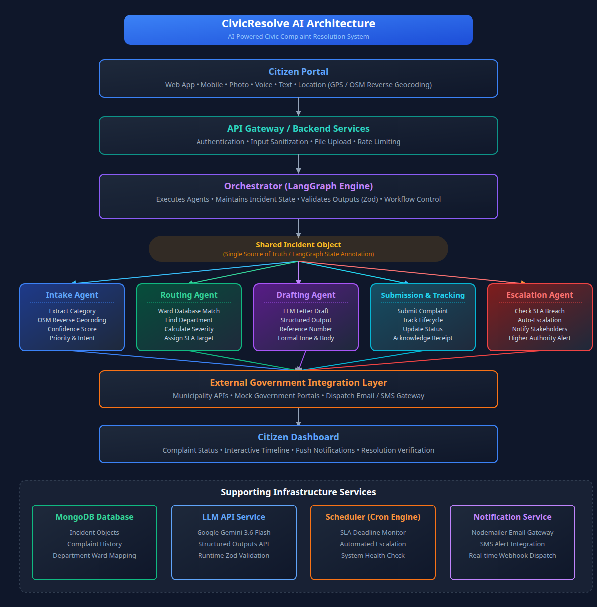
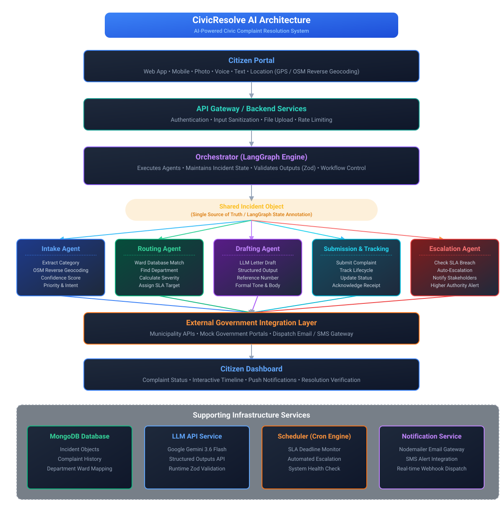
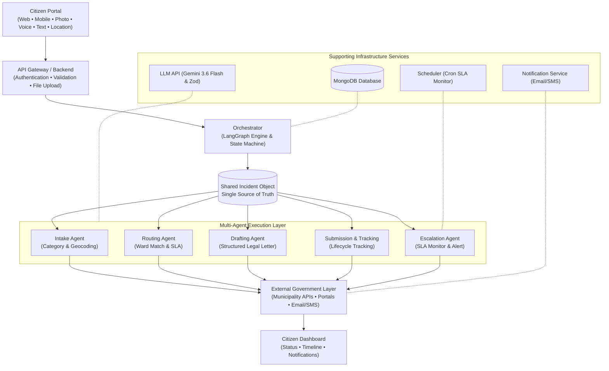

# CivicResolve AI — System Architecture

This folder contains the complete architecture design documents, PNG photo renders, SVG vector graphics, Excalidraw diagrams, and workflow representations for **CivicResolve AI (AI-Powered Civic Complaint Resolution System)**.

---

## 📸 Architecture Diagram (PNG Photo Format)

---

## 🎨 Scalable Vector Graphic (SVG Format)

---

## 🔀 Interactive Flowchart (Mermaid)

---

## 📂 Architecture Files

| File Name | Format | Description |
| :--- | :--- | :--- |
| **[`civic_resolve_architecture.png`](./civic_resolve_architecture.png)** | **PNG Photo Image** | High-resolution raster photo render (445 KB). |
| **[`civic_resolve_architecture.svg`](./civic_resolve_architecture.svg)** | **SVG Vector** | Scalable vector graphic diagram. |
| **[`civic_resolve_architecture.excalidraw`](./civic_resolve_architecture.excalidraw)** | **Excalidraw JSON** | Editable diagram file for [Excalidraw.com](https://excalidraw.com). |
| **[`civic_resolve_architecture.md`](./civic_resolve_architecture.md)** | **Markdown Doc** | Comprehensive design document. |
